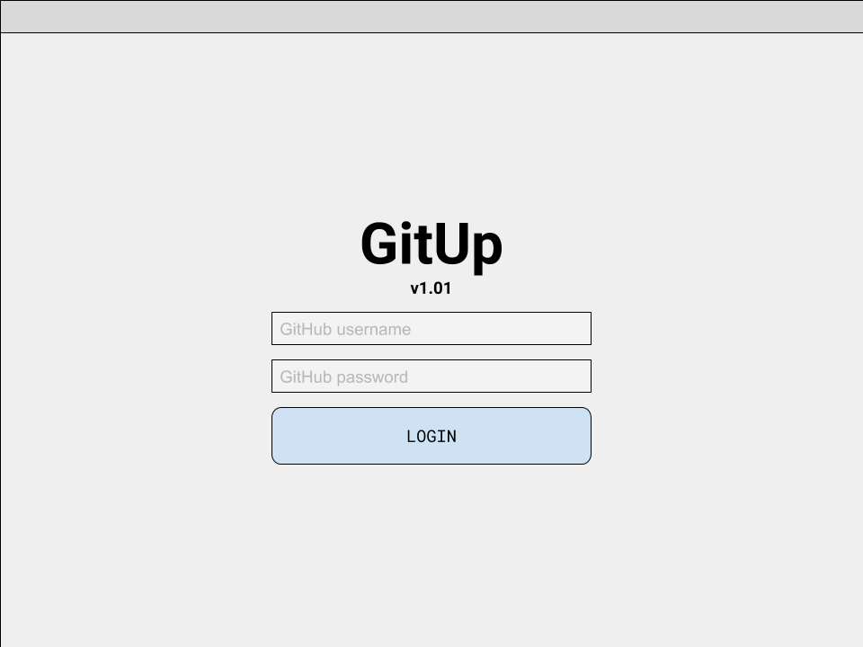
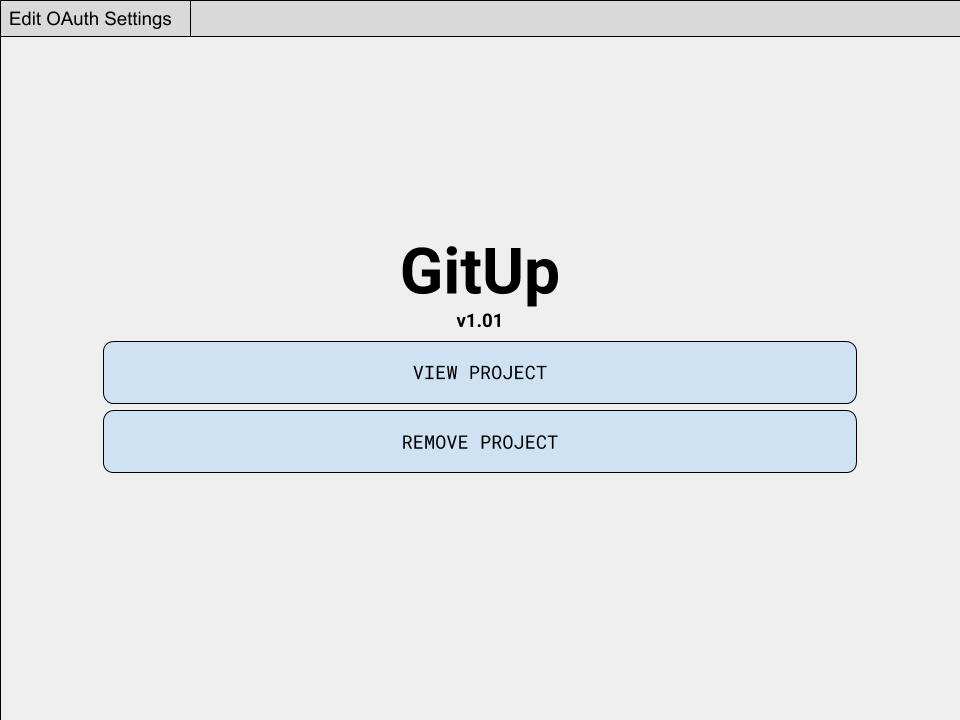
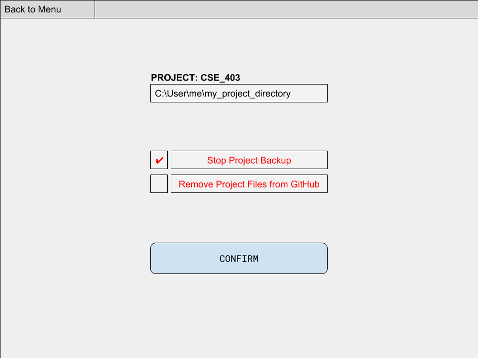
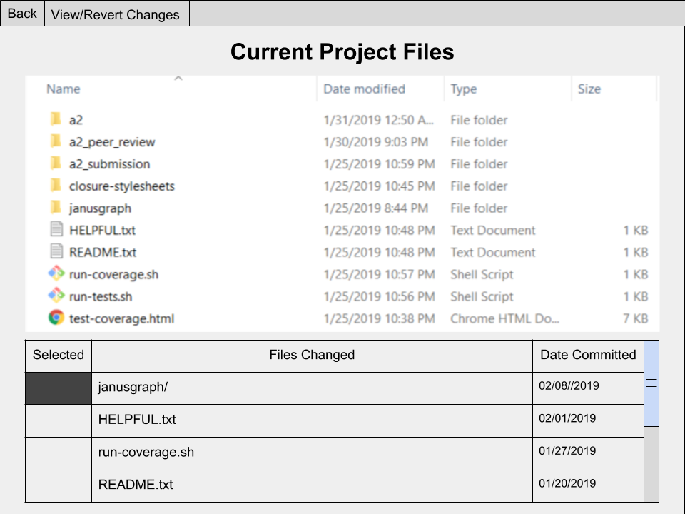
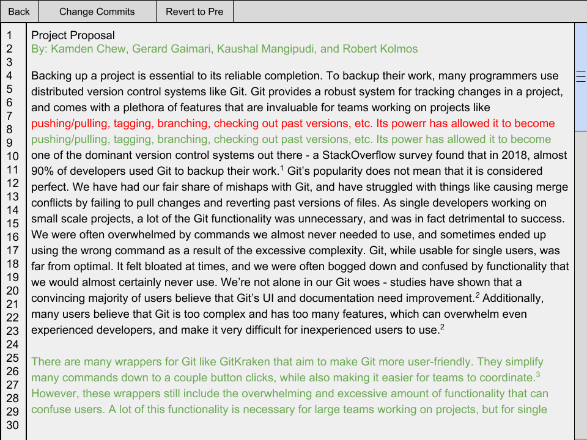
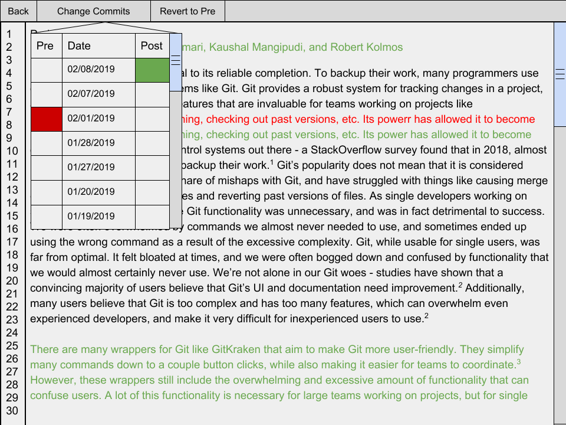

#Welcome to GitUp!

GitUp is a portable and fast backup tool with powerful version history features that’s easy for anyone to use!

##Why GitUp?

Whether you’re writing your first software project or novel, backing up your work is essential. In the past, you might have relied on tools like Google Drive, DropBox, Carbonite, or BackBlaze to backup your work. They might give you an extra copy of your files but where did all the history that went into making them go? We learn best from our past "mistakes" and sometimes we need them back but most *back*up tools simply don’t have that functionality, that’s why we made *Git*Up. If you’ve done a bit of digging, you might have heard of something called a ‘version control system’. Most full time developers use VCSs like git to backup their work, but they are very unfriendly to new users and require a lot of time and effort to understand. There are tools like GitKraken or Gitless that claim to make using VCSs easier, but they still require you to take the time to understand how VCSs work before you can use them. Why waste time learning how to use a VCS to backup when you could just GitUp? It’s the best backup solution for you to easily compare and revert file and project history that learns from the tools of the past!

##Requirements:##

As of now, GitUp only works on Linux based systems. Additionally, to use GitUp, you must have a GitHub account. GitHub is a powerful hosting service for projects that back up their work using a version control system called git. You don’t need to worry about what git is! Just know that we’ll use your GitHub account to back up your work. If you don’t have a GitHub account, simply go to [https://github.com/join?source=header-home](https://github.com/join?source=header-home) and create an account!

##Download GitUp:##

Simply download the runnable program at [URL for executable] to an easily accessible place on your system, and you’re good to go!

#Using GitUp:#

Congratulations! You now have everything you need to use GitUp. To begin, simply click on the GitUp executable file. When you do, GitUp will open and you’ll be greeted by the main menu:

##Logging in:##

The first thing you’ll need to do after opening GitUp is login. Simply click on the *Edit OAuth Settings* button in the upper left hand corner of the main menu to do so. You’ll be prompted to enter your GitHub username and password:

After successfully logging in you will be taken to the main menu:

Because we respect your privacy, GitUp will **never under any circumstances** store any of your GitHub account information. If you don’t believe us, feel free to take a look at our source code at [https://github.com/gerar231/GitUp](https://github.com/gerar231/GitUp). On your first login you we will create an authorization token for your account to GitUp, you can manage GitUp’s permissions at any time from your account by clicking "*Edit OAuth Settings*" on the main menu, this will redirect you to [https://github.com/settings/applications](https://github.com/settings/applications). From here click on “*Authorized OAuth Apps”* and you can remove/edit GitUp’s permissions. 

Revoking GitUp permissions from your GitHub account will stop all project backups until you login again.

##View A Project##

To start backing up projects with GitUp simply click *View a Project* and select the project directory on your machine.

Once you’ve viewed a project directory in GitUp, you won’t ever have to worry about backing up your work! GitUp will automatically attempt back up your work whenever you save a file. If syncing fails, we will give you a warning about which files could potentially become out of sync with the backed up version.

Gitup stores a variety of types of data such as the names of the projects the user has created, which ones are active on the current machine, the paths to the root folder of each project, and the URL to the github repository. This data is stored in a file called projects.csv in directory gitup is installed to.

##Remove A Project##

To stop backing up a project with GitUp simply click *Remove a Project*. 

Removing a project from a backup is very simple, but takes a few steps for security sake. The first screen you will see is a confirmation to re-enter your username and password, as mentioned we do not store this information, but we do want to verify with GitHub that it is you! Next select a project directory on your machine, if this is a valid GitUp project then a dialog box will be shown with the project directory, and two options:

1. Stop Project Backup

2. Remove Project Files from GitHub

If you select "*Stop Project Backup" *GitUp will no longer backup files from this project on GitHub but the files will remain on your GitHub account.

If you select *"Remove Project Files from GitHub" *GitUp will remove your project files from your GitHub account (permanently deleting all backup history) but will continue backing up this project to GitHub.

Upon hitting the "*CONFIRM*" button all changes will be applied, shown below:

#The Project View Screen:#

##View/Revert Changes##

Selecting a file and clicking the "View/Revert Changes" button from the project screen allows the user to see a file’s history. The diff between the two commits is displayed and the user sees insertions in green and deletions in red.

By clicking "Change Commits" the user sees a menu allowing them to select a pre and post commit. Clicking “Revert to Pre” will allow the user to set the current file to whatever previous commit they currently have selected in the “Change Commits” table. 

##Syncing changes##

You don’t need to worry about syncing changes! GitUp will automatically back up your work whenever you change. If syncing fails, we will give you a warning about which files could potentially become out of sync with the backed up version.

#Important Notes#

Since the projects are on your GitHub account, you can modify your project using git. However, we strongly discourage doing this, as GitUp will handle all aspects of backing up your work and viewing/reverting past versions for you. Also, proceed with caution whenever you get a warning that something could potentially become out of sync! If a file becomes out of sync, GitUp will automatically attempt to resolve it, though you may lose work when it does so.

##Projects that helped us:##

[TKinter](https://docs.python.org/3/library/tk.html) 

[GitPython](https://gitpython.readthedocs.io/en/stable/)

[PyGithub](https://pygithub.readthedocs.io/en/latest/index.html) 

[Inotify](http://man7.org/linux/man-pages/man7/inotify.7.html)
