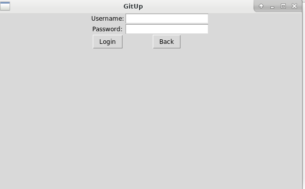
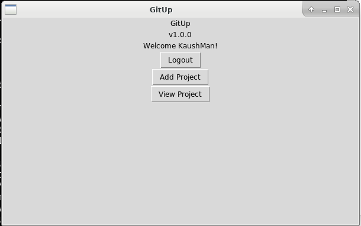
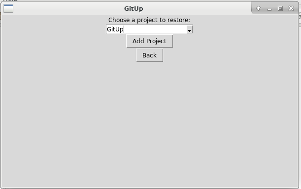
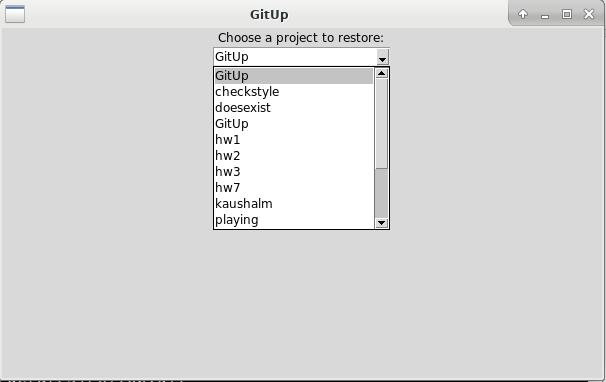
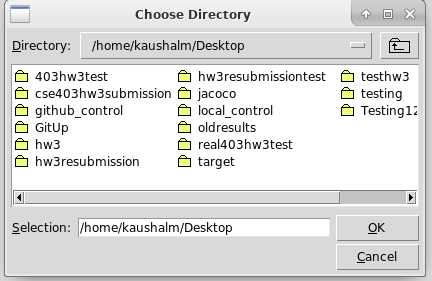
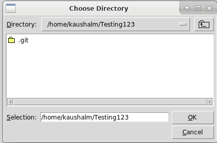
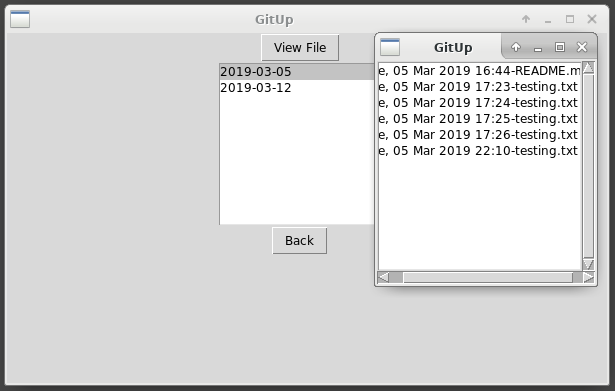
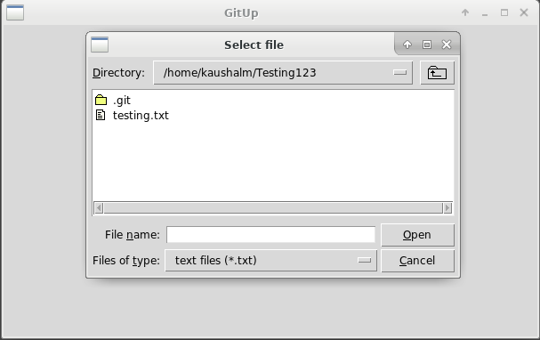
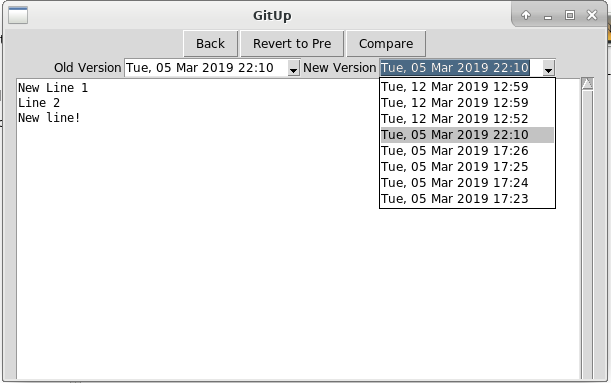
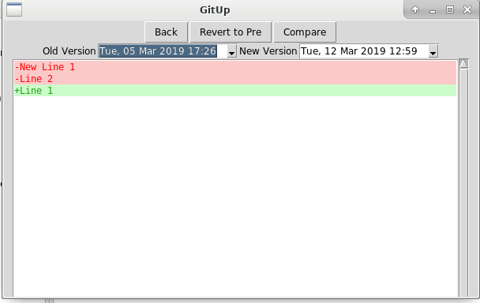

# Welcome to GitUp!

GitUp is a portable and fast backup tool with powerful version history features that’s easy for anyone to use!

## Why GitUp?

Whether you’re writing your first software project or novel, backing up your work is essential. In the past, you might have relied on tools like Google Drive, DropBox, Carbonite, or BackBlaze to backup your work. They might give you an extra copy of your files but where did all the history that went into making them go? We learn best from our past "mistakes" and sometimes we need them back but most *back*up tools simply don’t have that functionality, that’s why we made *Git*Up. If you’ve done a bit of digging, you might have heard of something called a ‘version control system’. Most full time developers use VCSs like git to backup their work, but they are very unfriendly to new users and require a lot of time and effort to understand. There are tools like GitKraken or Gitless that claim to make using VCSs easier, but they still require you to take the time to understand how VCSs work before you can use them. Why waste time learning how to use a VCS to backup when you could just GitUp? It’s the best backup solution for you to easily compare and revert file and project history that learns from the tools of the past!

## Requirements

As of now, GitUp only works on Linux based systems. Additionally, to use GitUp, you must have a GitHub account. GitHub is a powerful hosting service for projects that back up their work using a version control system called git. You don’t need to worry about what git is! Just know that we’ll use your GitHub account to back up your work. If you don’t have a GitHub account, simply go to [https://github.com/join?source=header-home](https://github.com/join?source=header-home) and create an account!

## Download GitUp

To download GitUp quickly and easily just download our executable zip found at: [https://www.dropbox.com/sh/9jsd261dos98f6n/AABZnOT4SGWmfYVqMDnTKFSMa?dl=0](https://www.dropbox.com/sh/9jsd261dos98f6n/AABZnOT4SGWmfYVqMDnTKFSMa?dl=0)
Once downloaded you will need to unzip the contents. After unzipping, you should have a directory called GitUp. Inside this directory
you will find the GitUp executable and a git_attributes.txt file. To ensure functionality, please do not restructure this directory.

If you'd prefer to build from source, please see the "Building from Source" section at the end of this document.

## System Requirements

The only operating system GitUp currently supports is Linux. Other than this, there are no other requirements to run GitUp if
you download our executable.

If you want to build from source, see the requirements in the "Building from Source" section at the end of this document.

# Using GitUp:

Congratulations! You now have everything you need to use GitUp. To begin, simply click on the GitUp executable file. When you do, GitUp will open and you’ll be greeted by the main menu:

## Logging in

The first thing you’ll need to do after opening GitUp is login. Simply enter your GitHub username and password where prompted and click 'Login':

After successfully logging in you will be taken to the main menu:

To login to your GitHub account GitUp uses a well established authorization service called OAuth which can be used to login to other services without privacy concerns.
On your first login we will create an authorization token for your account to GitUp, you can manage GitUp’s permissions at any time from your account by clicking "*Edit OAuth Settings*" on the main menu, this will redirect you to [https://github.com/settings/applications](https://github.com/settings/applications). From here click on “*Authorized OAuth Apps”* and you can remove/edit GitUp’s permissions. 

Revoking GitUp permissions from your GitHub account will stop all project backups until you login again.

## Restore a project
To add a project backed up remotely but not locally, first click on 'Add Project'. Then, you'll be greeted by the following window:

Click on the combobox to select a project to restore:

Once you've selected a project, click on 'Add Project'. Then, you'll need to select to where you want to add the project:

After the project has been added, you'll go back to the main menu. Congratulations, you now have successfully added the backed up project to your local machine!

## View A Project
To start backing up projects with GitUp simply click 'View Project'. At that point, you'll be prompted to select a directory:

Once you select a directory, GitUp will automatically back up the directory if it isn't already backed up. At this point, your work is now being backed up!  GitUp will automatically attempt back up your work whenever you save a file. If syncing fails, we will give you a warning about which files could potentially become out of sync with the backed up version.

Once you've selected the directory, you'll be greeted by the following menu:

The list is a big picture view of all the changes you've made to your project. If you click on a date, you can see all the changes you've made to your project that day! If you want to look in depth at the changes you made to a specific file, simply click 'View File'. Then, you'll be prompted to select a file:

Once you've selected a file, you'll be greeted by the following screen:

You can select an old and new version to compare with one another. If you select the same version for both, then it will just display that version of the file. However, if you select different versions, you'll get something like the following:

Black text is the same between both versions, red text is text that is only in the old version, and green text is text that is only in the new version. If you ever want to revert the back to a previous version, simply click on 'Revert to Pre', and the file will be reverted to whatever version you selected as your Old Version.

# Important Notes

Since the projects are on your GitHub account, you can modify your project using git. However, we strongly discourage doing this, as GitUp will handle all aspects of backing up your work and viewing/reverting past versions for you. Also, proceed with caution whenever you get a warning that something could potentially become out of sync! If a file becomes out of sync, GitUp will automatically attempt to resolve it, though you may lose work when it does so.

## Building from Source

Requirements:
The only operating system GitUp currently supports is Linux. On top of this, your system will need to have Python version 3.7 installed: [https://www.python.org/downloads/release/python-372/](https://www.python.org/downloads/release/python-372/).

To build from source, first clone our git repository from [https://github.com/gerar231/GitUp](https://github.com/gerar231/GitUp) using "git clone https://github.com/gerar231/GitUp". The second step is to download PyBuilder, which we use to build our project. You can run "sudo python3.7 -m pip install -U --pre pybuilder" from the terminal to download this. Next, navigate into the repository from the terminal. After navigating to the repository, first run the command "sudo pyb install_dependencies", followed by "sudo pyb". 

To run GitUp, navigate from the top level of the repository to /src/main/python/ and then run "python3.7 GitUp.py".

## Projects that helped us:

[TKinter](https://docs.python.org/3/library/tk.html) 

[GitPython](https://gitpython.readthedocs.io/en/stable/)

[PyGithub](https://pygithub.readthedocs.io/en/latest/index.html) 

[Inotify](http://man7.org/linux/man-pages/man7/inotify.7.html)
